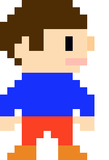
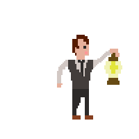
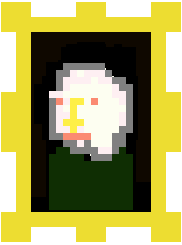
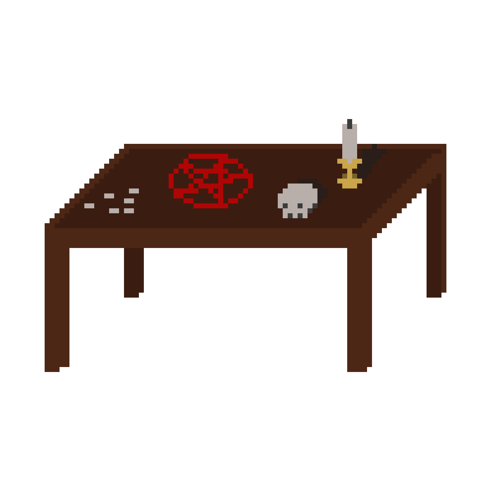
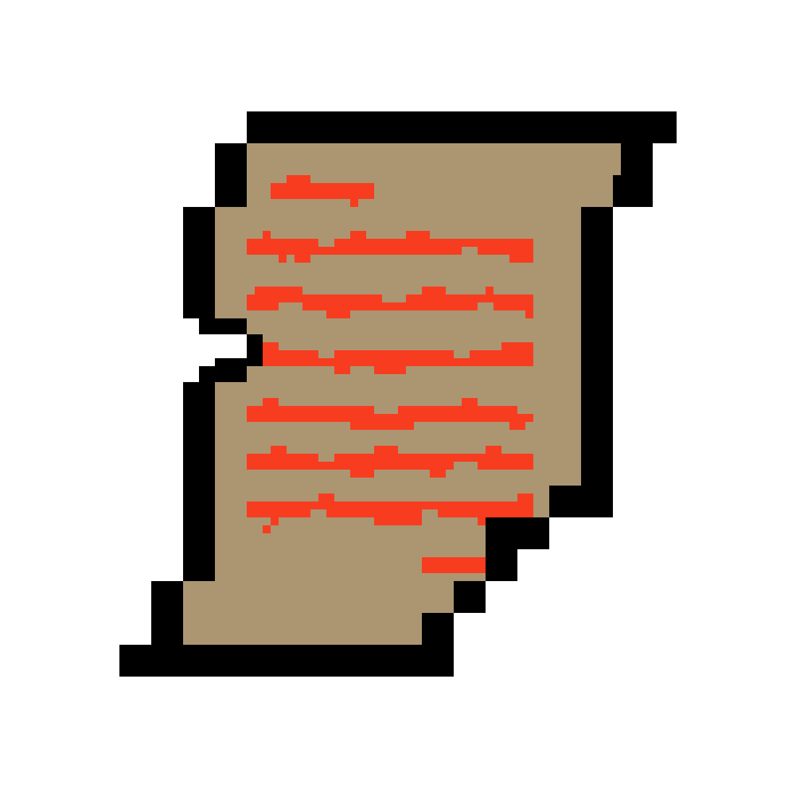

# Stalker 

**Stalker** is a escape room inspired game with a horror theme.  
[Play Stalker!](https://jamsuham22.github.io/escape/)

## Story 

"I woke up to a musky odor.."  
"Who am I? And where am I...?"  
"All I know.. I need to get out.."  

Tom is an attractive fella. One day.. he wakes up locked up without any memories. He needs to find clues to recover his memory and to get out of the creepy, seemingly haunted room...

## The Game

Users can move the main character, Tom, with the arrow keys. They can collect items by simply approaching it and use the items by pressing the space key. 

Tom is animated through javascript to make the game more visually appeasing.

The colors used, were mainly black, red, and yellowish toned to emotionally affect the players.

Throughout the game, there are minor jumpscares. Users must look for clues and hints to help Tom collect pieces of his memory and escape the dreaded cabin.

## MVP

In Escape, users will be able to experience: 

* Story telling through in game modals
* Toggle music on and off
* Move the main character in multiple directions
* Animated character movements
* Pick up items
* Toggle inventory slots through in game modal
* Read item description through inventory slot
* Interact with different settings (Collision logic)
* Movement based game flow - events happen depending on game play

In addition, this project will include:

* A key map to help users with control
* links to AngelList, Github, and LinkedIn
* A production README

## Architecture and Technologies

This project will be implemented with the following technologies:

JavaScript for game logic
Canvas with HTML5

## Development Log

**Day 1:** Think of a storyline, way to tell the story, main character design, create sample main character sprites. 

**Day 2:** Create more sprites, and develope a better story line that will grasp the users attention. Make sprites for painting, trap door, left wall, and rest of background. Set up files and classes for core objects, study and research on how to create a great (and short) game. Create filter for lantern effect in a dark room.

**Day 3:** Light research on color theme and psychological effects of colors. Enable users to control the main character. Create more sprites including shadow, key, inventory slots, narration/interation box. Create logic for animation, and animate the character while character is moving.

**Day 4:** Enable users to pick up items. Set up narration, inventory, phrases, and other objects and items needed to continue game storyline.  

**Day 5:** Enable users to see what items they currently hold, see description on the items, and allow movement based events- table surprise and footstep mp3. Final changes to storyline, enhance game logic, implement collision logic, and create tables.  

Instead of adding the sequence in the diary, added different images to tell the diary's sequence for extra story telling. 
 New
 Older
 Oldest

**Day 6:** Create the last diary piece, adjust storyline from having letters to the antagonists to antagonist's diary pages. Make  Create starting splash page, add enter button in action. Finish game with ending storyline, game over logic, and ending splash view. Completed.

